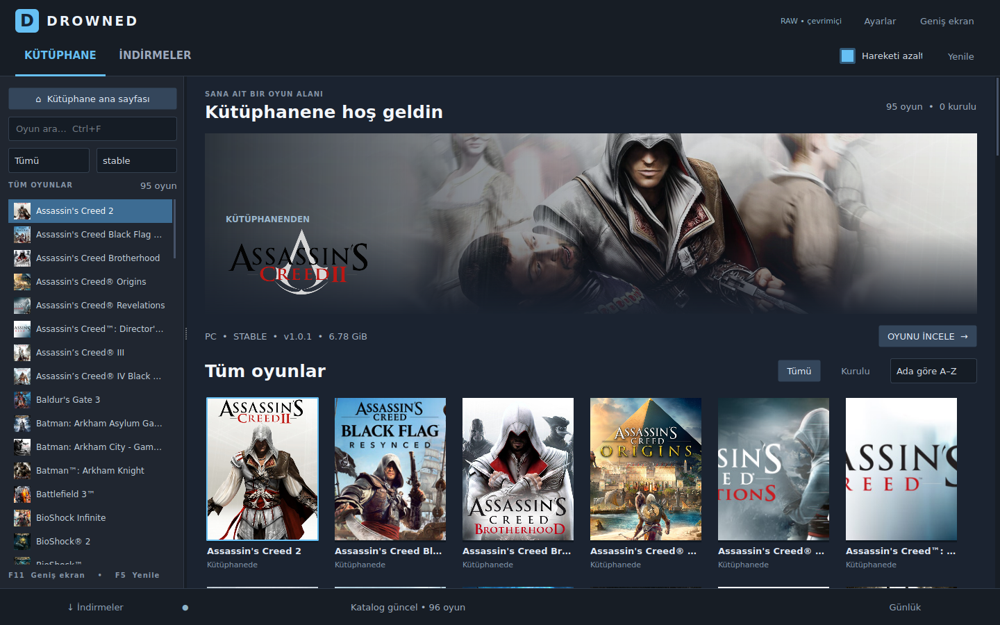
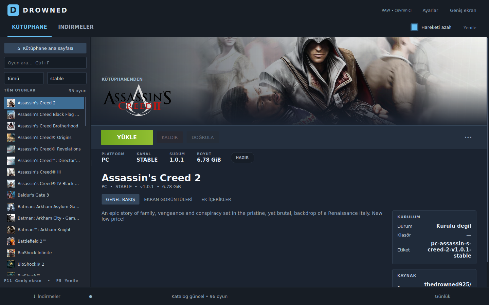
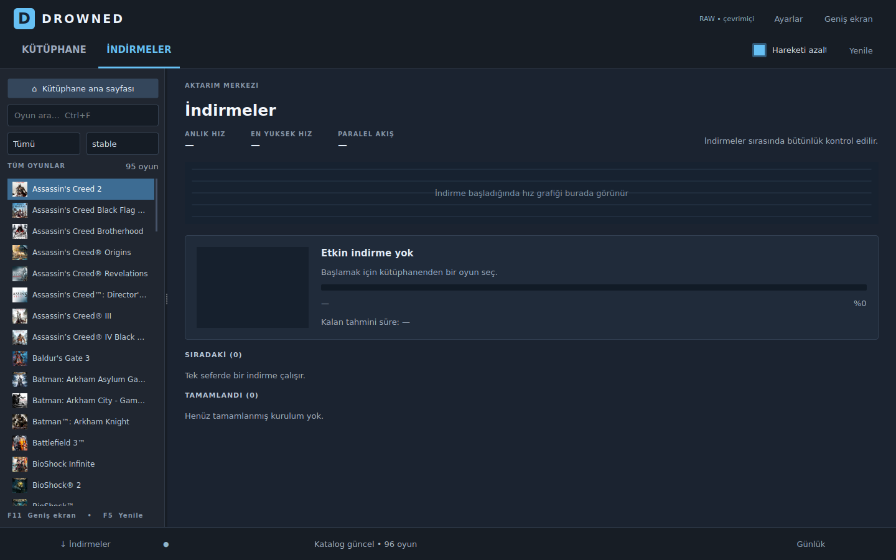

# Drowned Launcher — Steam Desktop Preview

Steam tarzında, PySide6 ile hazırlanmış yerel Windows launcher. Geliştirme dalı:
`feat/launcher-steam-desktop`. Giriş noktası `windows/launcher/app_steam.py`.

## Kapsam ve uyumluluk

Bu dal mevcut dosyaları değiştirmeden yeni launcher dosyaları, testler ve ayrı bir
önizleme builder'ı ekler. Release Manager, ortak indirme/kurulum backend'i,
katalog, manifestler, eski launcher sürümleri ve mevcut build/release workflow'ları
aynı kalır. `main` dalına birleştirme veya release yayımlama yapılmaz.

Yeni arayüz v18'in de kullandığı v12 işlev katmanını doğrudan devralır. Kurulum,
güncelleme, doğrulama/onarım, kaldırma, duraklatma/devam, iptal, ek paketler,
katalog önbelleği ve Big Picture'ın düzeltilmiş kol/klavye gezinmesi korunur.

- Mevcut `QSettings("Drowned", "Launcher")` kimliği ve anahtarları korunur.
- Mevcut `installed_games.json` ve yarım indirme kayıtları aynı yerden okunur.
- Arayüzün açılması mevcut ayarları veya kurulum kayıtlarını yeniden yazmaz.
- Hareket tercihi ve oyun çalıştırma dosyası seçimi ayrı
  `QSettings("Drowned", "LauncherSteamDesktop")` alanında tutulur.
- Yeni `.exe` mevcut kurulum ve ayarları görür. Kullanıcı bu önizlemede bir oyunu
  kaldırır, kurar veya kaynak ayarlarını değiştirirse, bu gerçek işlem ortak
  kurulum/ayar verisine uygulanır; önizleme bir veri sandbox'ı değildir.

## Arayüz

- Koyu lacivert uygulama kabuğu, üst gezinme ve solda aranabilir oyun listesi.
- Geniş oyun görseli, kapak rafları, kurulu filtresi ve A–Z / Z–A / boyut sıralama.
- Yerel oyun detayları; genel bakış, ekran görüntüleri ve ek içerik sekmeleri.
- Gerçek hız örneklerinden çizilen indirme grafiği, ilerleme, tahmini süre,
  duraklatma/devam, iptal, günlük ve tamamlanan kurulumlar.
- Kart yakınlaşması, düğme vurgusu, sayfa geçişleri, yavaş hero kamera hareketi.
- Hareketi azalt seçeneği; gizli hero ve görünmeyen liste satırlarının sürekli
  animasyonları durdurulur.
- En az 1080×700 pencere; dar ekranda ayrıntılar dikey kaydırılabilir.

Kurulu oyundaki **Oyna** ilk kullanımda oyun klasörü içindeki `.exe` dosyasını
seçtirir ve seçimi hatırlar. Dosya yolu kabuk komutu olmadan çalıştırılır; kurulum,
onarım veya kaldırma sürerken başlatma engellenir. Oyunlara özel başlatıcı/DRM
kurulumu, argüman gereksinimi veya emulator entegrasyonu bu sürümün kapsamı değildir.

## Çalıştırma

Repository kökünde, Python 3.13 ile:

```powershell
python -m pip install shared/python
python -m pip install -r windows/launcher/requirements.txt
python windows/launcher/app_steam.py
```

Bağımlılıklar kurulduktan sonra `windows/launcher/run_steam_preview.bat` dosyası
aynı giriş noktasını açar. Eski giriş noktaları da kullanılmaya devam edebilir.

## Ayrı Windows build

`Build Launcher Steam Preview` workflow'u yalnızca bu dalın yeni launcher
kaynakları değiştiğinde çalışır. Sadece launcher üretir. Yetkisi `contents: read`;
release yayımlamaz, tag oluşturmaz, katalog veya build durumu dosyası yazmaz.

Actions çalışmasının **Artifacts** bölümünden
`Drowned-Launcher-Steam-Preview-Windows-x64` arşivini indirip tamamını çıkar.
`Drowned-Launcher-Steam-Preview.exe` dosyasını `_internal` klasörü ile birlikte tut.

Yerel build:

```powershell
python -m pip install pyinstaller
powershell -File windows/launcher/build_steam_preview.ps1
```

Çıktı: `dist/Drowned-Launcher-Steam-Preview/`. Mevcut builder'ın adı ve çıktısı
kullanılmaz. Mevcut `Build Windows` workflow'u hâlâ `app_v18.py` üretir.

## Kısayollar

| Kısayol | İşlev |
| --- | --- |
| Ctrl+F | Oyun arama |
| Ctrl+J | İndirmeler |
| Alt+Home | Kütüphane ana sayfası |
| F5 | Kataloğu yenile |
| F11 | Big Picture |
| Esc | Detaydan ana sayfaya; Big Picture'da önce oyun sayfasından, sonra tam ekrandan çık |

## Doğrulama

```powershell
python -m unittest discover -s tests -v
```

Native UI testleri geçici ayarlar ve kurulum klasörleri kullanır. Ağ, dosya seçici
ve işletim sistemi üzerinden oyun başlatma işlemleri testlerde taklit edilir.
Ayar koruma, filtre/sıralama seçimleri, boş durum, eski görsel yanıtı, tek düğme
bağlantısı, ek paket sekmesi, aktarım kontrolleri, güvenli `.exe` seçimi,
onarım/başlatma yarış durumu ve küçük pencere yerleşimi doğrulanır.

Linux doğrulaması Windows'ta gerçek bir oyunu çalıştırmış olmak anlamına gelmez.
Windows workflow'u ayrıca PyInstaller modüllerini ve paketlenmiş `.exe` dosyasının
başlangıçta kapanmadığını denetler. Gerçek indirme/kurulum ve Xbox kolu ile fiziksel
Windows doğrulaması mevcut kullanıcı ortamında ayrıca yapılmalıdır.

## Gerçek uygulama görüntüleri

Aşağıdakiler repository'nin mevcut katalog ve artwork dosyalarıyla, dış ağdan
indirme yapmadan Qt uygulamasından alınmıştır. İşletim sisteminin pencere çerçevesi
görüntülere dahil değildir.






